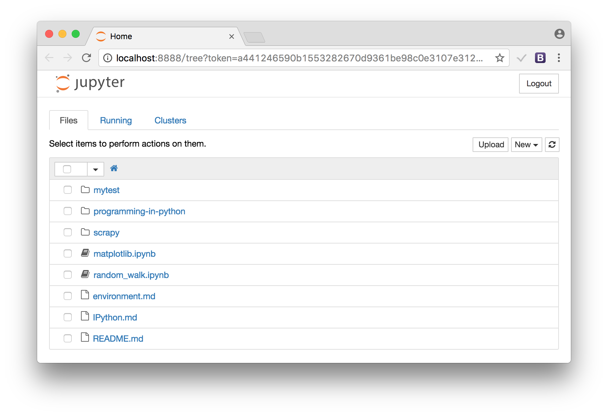

# Environment

## IPython notebook
Ref: [Running the Notebook](https://jupyter.readthedocs.io/en/latest/running.html)

```
$ jupyter notebook
    ...(skipped)
    Copy/paste this URL into your browser when you connect for the first time,
    to login with a token:
        http://localhost:8888/?token=46f0d72e6e316d787f1c59b07935f5e8b609fbfd8ef2807f
```



## Docker

Pull a docker image @host
```
$ docker pull dylanmei/zeppelin
```

> https://hub.docker.com/r/dylanmei/zeppelin/

Run/execute the docker container @host
```
$ export MYHOME=$HOME/github/learn-python
$ docker run --name python -p 8080:8080 -v $MYHOME:/learn-python -e "MYHOME=/learn-python" -d dylanmei/zeppelin
$ docker exec -it python bash
```
